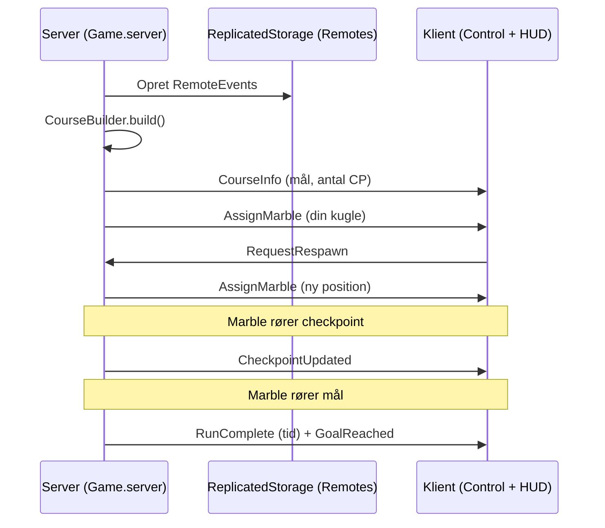

# Marble Run — udviklerguide

Denne guide er til dig, der er ny i Roblox/Luau og vil forstå **hvordan spillet hænger sammen**.

## Hurtig start

1. Byg place: `rojo build -o Marble.rbxlx` (fra `Games/Marble`)
2. Åbn `Marble.rbxlx` i Roblox Studio
3. Tryk **Play**

Alternativt: `rojo serve` + Rojo-plugin (live sync fra filer).

## Mappestruktur

```
Games/Marble/
  default.project.json     → Rojo: hvilke mapper bliver til hvilke Roblox-tjenester
  src/
    ReplicatedStorage/Shared/
      Config.luau          → Tal alle deler (hastighed, kamera, osv.)
      Remotes.luau         → RemoteEvents (server ↔ klient)
      CourseState.luau     → Klient-state (tid, mål-position) — deles af HUD + kontrol
    ServerScriptService/
      CourseBuilder.luau   → Bygger hele banen (Parts)
      ObstacleEngine.luau  → Bevægelige platforme, spinners, hop-plader
      Game.server.luau     → Spillogik: marble, checkpoints, mål
    StarterPlayer/StarterPlayerScripts/
      MarbleControl.client.luau  → Input, hop, kamera, Enter → mål
      Hud.client.luau              → Timer, checkpoints, afstand til mål
```

## Roblox-tjenester (kort)

| Sted | Hvem kører det? | Eksempel i dette spil |
|------|-----------------|------------------------|
| `ServerScriptService` | Kun server | Spawn marble, tæl checkpoints |
| `StarterPlayerScripts` | Kun klient (LocalScript) | WASD, kamera |
| `ReplicatedStorage` | Begge (ModuleScripts) | `Config`, `Remotes` |

**Regel:** Spilleren må aldrig bestemme “sandheden” (point, mål, checkpoints). Det gør serveren. Klienten viser UI og sender **ønsker** (fx respawn via `RequestRespawn`).

## Dataflow (diagram)



## Banen (`CourseBuilder.luau`)

- Alle gulve bygges så **toppen** af parten er banens overflade (`topY`).
- Segmenter **overlapper** med `OVERLAP` studs, så der ikke opstår smalle huller.
- **Checkpoints** er neon-plader + usynlig trigger med attributten `CheckpointIndex`.
- **Mål** er en usynlig part med `IsGoal = true` (attribute).

## Forhindringer (`ObstacleEngine.luau`)

| Type | Sådan virker det |
|------|------------------|
| Bevægelig platform | `Heartbeat` flytter part sinusform |
| Spinner | Arm roterer om hub |
| Bounce pad | `Touched` + attribut `BouncePower` |
| Is | Lav friktion via `CustomPhysicalProperties` |

Marbles markeres med `IsMarble = true` på serveren, så forhindringer kun påvirker spiller-kugler.

## Spiller-kugle

- Standard avatar slås fra: `Players.CharacterAutoLoads = false`
- Marble er en `Part` med `Shape = Ball`
- `SetNetworkOwner(player)` giver klienten fysik for mindre input-forsinkelse
- Fald under `Config.RespawnY` → respawn ved sidste checkpoint (eller start)

## Input (klient)

| Tast | Funktion |
|------|----------|
| WASD | Rul (relativt til kamera) |
| Pile | Drej kamera |
| Space | Hop (kun hvis raycast rammer jord) |
| Enter | Drej kamera mod mål (navigation uden mus) |
| R | Bed server om respawn |

**Enter / mål-kamera:** Klienten kender målets `Vector3` fra `CourseInfo`. Den beregner vinkel i XZ-plan og drejer `cameraYaw` (og lidt `cameraPitch`) indtil spilleren “kigger mod mål”.

## Remotes (liste)

| Event | Retning | Indhold |
|-------|---------|---------|
| `CourseInfo` | S → C | `{ goalPosition, checkpointCount }` |
| `AssignMarble` | S → C | Marble `BasePart` |
| `RequestRespawn` | C → S | (ingen) |
| `CheckpointUpdated` | S → C | `index, total` |
| `RunComplete` | S → C | `elapsedSeconds` |
| `GoalReached` | S → C | (banner) |

## Typiske ændringer

**Gøre banen længere:** Tilføj flere `floorBox` / `rampX` / `rampZ` i `CourseBuilder.build()` — husk overlap og vægge.

**Ny forhindring:** Tilføj funktion i `ObstacleEngine` og kald den fra `CourseBuilder`.

**Justér fart:** `Config.luau` → `Marble.MaxForce`, `MaxSpeed`.

**Flere checkpoints:** Kald `addCheckpoint(...)` og sørg for stigende `index`.

## Fejlsøgning i Studio

- **Output** vinduet: server/klient `print` og fejl
- Marble findes ikke: tjek at `Game.server` kører (ServerScriptService)
- Ingen input: tjek at scripts ligger under `StarterPlayerScripts` og hedder `.client.luau`
- Hop virker ikke: raycast rammer ikke gulv (huller i bane) — ret overlap i `CourseBuilder`

## Videre læsning

- [Roblox Creator Docs — Scripting](https://create.roblox.com/docs/scripting)
- [Rojo dokumentation](https://rojo.space/docs/v7/)
